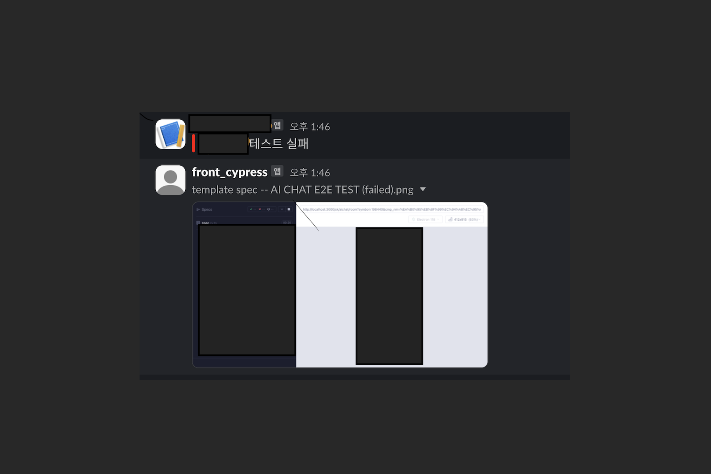

##### Cypress

사용자 입장에서 서비스를 테스트 하고 싶을때 뿐만 아니라 가장 적합한 테스트 도구이다. <br/>
우리 회사는 QA 인원이 한정적이기 때문에 <br/>반복적인 QA 작업은 점진적으로 Cypress 를 도입하고 있다.<br/>

CI/CD 에 테스트를 넣어서도 진행할 수 있지만<br/>
AI 챗봇 서비스에서 일부 신규상장건 및 사명변경이 된 종목들은 화면에서 종목명과<br/>
답변의 종목명이 다르게 보이는 이슈가 있었다.

이는 백엔드 측에서 매일 아침 서비스에 들어가 일일히 신규상장건을 확인한다는 제보를 받았다.<br/>
물론 국내쪽만 확인하는 터라 그렇게 많지는 않은 갯수였지만<br/> 이 또한 여러모로 리소스가 드는 일이다.<br/>

#### 구현하고 싶은 사항

1. 그날 이슈가 있는 종목을 리스트로 받아 매일 아침 8시 40분에 <br/>종목별로 사명이 맞게 들어가는지 테스트를 한다.
2. 해당 종목의 테스트 결과를 SLCAK 채널로 전송한다.
3. 단순히 테스트 실패 여부를 보내기 보다는 어떤 종목에서 이슈가 생겼는지 실패한 스크린샷을 보낸다.

#### 테스트 코드 작성하기

우선 구현하고자 하는 테스트 코드를 작성한다. (샘플코드)<br/>
신규상장건들은 굳이 DB를 치지 않아도 될 일이라<br/>
매일 데이터팀에서 S3로 올려준 파일을 활용하여 받기로 하였다.<br/>

ex) spec.cy.ts

```javascript
describe("template spec", () => {
  it("AI CHAT E2E TEST", () => {
    신규상장건들.forEach(종목 => {
      cy.visit(
        `${URL}?symbol=${종목.symbol}&cmp_nm=${encodeURIComponent(종목.name)}`
      )

      cy.wait(7000)
      cy.contains(종목.name).should("be.visible")
    })
  })
})
```

#### 테스트 결과와 실패스크린샷 슬랙에 전송하기

- cypress test 하기
- 결과 여부 테스트 slack 채널에 전송하기
- 실패하면 어느 부분에서 실패했는지 스크린샷도 같이 보내기
- 이 모든 동작은 셸스크립트 파일로 자동화한다.

```sh
#!/bin/bash

#테스트 환경세팅, 실행
echo "E2E 테스트 시작"

export NVM_DIR="$HOME/.nvm"
[ -s "$NVM_DIR/nvm.sh" ] && \. "$NVM_DIR/nvm.sh"

nvm use 20.5.1

export PATH=$NVM_DIR/versions/node/v20.5.1/bin:$PATH

cd /Users/alpahbridge/code/alpha/tangopick_provider

yarn cypress:run > cypress.log 2>&1

# Cypress 로그 읽기 => 테스트 결과로 로그를 떨어트려 준다.
LOG_CONTENT=$(awk '/\(Run Finished\)/,0' cypress.log | jq -R -s '.')

```

테스트 환경을 세팅해주고 테스트실행, <br/>결과를 읽어 LOG_CONTENT라는 변수에 할당한다.

```sh

complete_upload_external() {
  local file_path="$1"
  local file_name=$(basename "$file_path")
  local file_size=$(stat -f%z "$file_path")

  # 업로드 URL 요청🔥
  local getupload_payload="filename=$(urlencode "$file_name")&length=$file_size&channels=$(urlencode "$SLACK_CHANNEL_ID")"

  local start_response=$(curl -s -X POST \
    -H "Authorization: Bearer $SLACK_TOKEN" \
    -H "Content-Type: application/x-www-form-urlencoded" \
    --data "$getupload_payload" \
    https://slack.com/api/files.getUploadURLExternal)

  local upload_url=$(echo "$start_response" | jq -r '.upload_url')
  local file_id=$(echo "$start_response" | jq -r '.file_id')

  if [ "$upload_url" = "null" ] || [ "$file_id" = "null" ]; then

    echo "업로드 url 얻기 실패: $start_response"
    return
  fi

  # 파일 업로드
  local upload_response=$(curl -s -F file=@"$file_path" "$upload_url")
  echo "파일 업로드 응답값: $upload_response"

  # 업로드 완료 요청🔥
  local complete_payload=$(jq -n --arg file_id "$file_id" '{
    file_id: $file_id,
    files: [{ id: $file_id }]
  }')
  echo "$complete_payload" > /tmp/complete_payload.json

  local complete_response=$(curl -s -X POST \
    -H "Authorization: Bearer $SLACK_TOKEN" \
    -H "Content-Type: application/json" \
    -d @/tmp/complete_payload.json \
    https://slack.com/api/files.completeUploadExternal)

  echo "파일 업로드 요청 응답값: $complete_response"

  # 파일 공유 요청🔥
 local share_payload="file=$(urlencode "$file_id")&channels=$(urlencode "$SLACK_CHANNEL_ID")"

  echo "$share_payload" > /tmp/share_payload.json

  local share_response=$(curl -s -X POST \
    -H "Authorization: Bearer $SLACK_TOKEN" \
    -H "Content-Type: application/x-www-form-urlencoded" \
    -d @/tmp/share_payload.json \
    https://slack.com/api/files.remote.share)

  echo "공유 응답값: $share_response"

}

# URL 인코딩 함수
urlencode() {
  local string="$1"
  local encoded=""
  for (( i=0; i<${#string}; i++ )); do
    local char="${string:$i:1}"
    case "$char" in
      [a-zA-Z0-9.~_-]) encoded+="$char" ;;
      *) encoded+=$(printf '%%%02X' "'$char") ;;
    esac
  done
  echo "$encoded"
}


```

테스트 결과를 읽고 슬랙으로 보내는것은 간단하나<br/>
어떤 종목이 실패해서 어떻게 보이는 상태인지 한번에 알려면 <br/>실패 스크린샷도 보내는게 맞는것 같았다. (그게 자동화의 이유자나)<br/><br/>
이를 위해 내가 이용한 slack api 는 3개다. (ㅠㅠ 한번에 보내는것도 만들어 줄 순 없었니)

- `files.getUploadURLExternal` : 임시 파일 upload url 을 얻는다.
- `files.completeUploadExternal` : 파일 업로드 시킴
- `files.remote.share` : 슬랙방에 파일(스샷)공유<br/><br/>
  upload 라는 메소드를 이용하려 했지만 <br/>해당 메소드는 25년부터 지원하지 않는다 하여

`getUploadURLExternal`, `completeUploadExternal` 두개의 메소드를 사용하였다.
슬랙방에 사진이 뜨기를 몇십번의 테스트를 진행하였고.<br/><br/><br/>
드디어 !<br/><br/>

<br/><br/>

#### 매일 아침마다 실행하도록 자동화하기

`Crontab` : 크론탭(Crontab)은 Unix 계열 운영 체제에서 사용되는 시간 기반 잡 스케줄러이다. <br/><br/>
크론탭을 사용 할 것이다.

```sh
crontab -e

```

시간 설정해주고 실행할 파일 기재해준다.

```sh
40 8 * * * /path/to/your/script.sh
```

작성한 쉘 스크립트는 오전 8시 40분 해당 테스트를 실행시켜 줄 것이다.

매일 이슈가 있는 종목들이 한개 이상씩은 나온다.<br/>
이러한 세팅이 앞으로 여러모로 쓸모가 있을것 같아 기분이 좋다.
