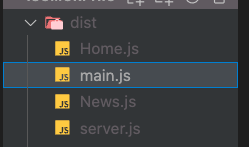
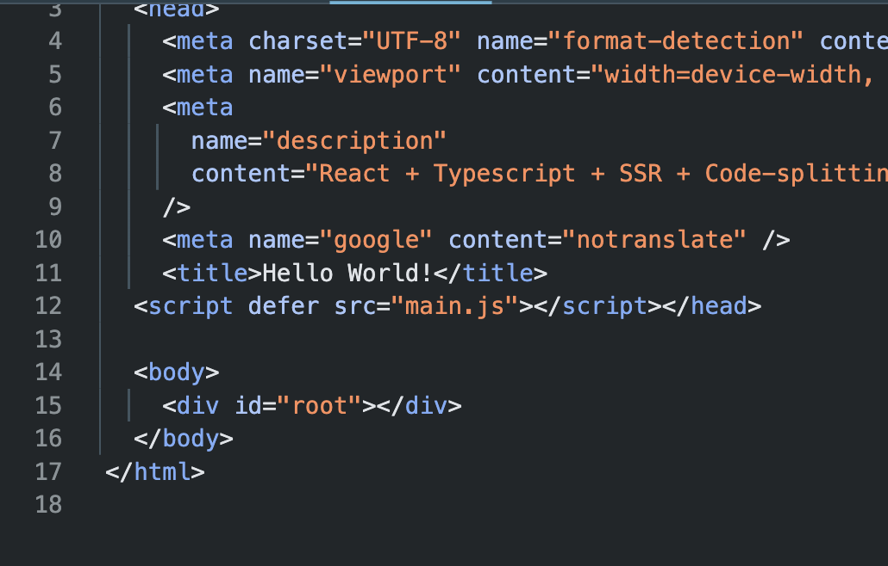
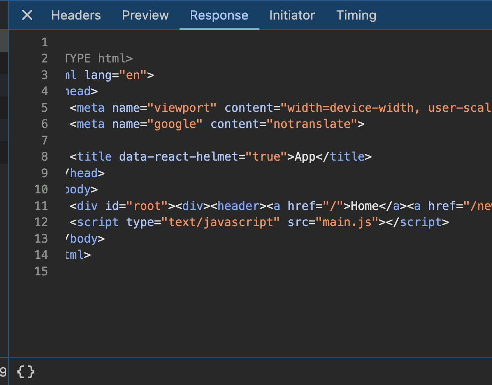

<!-- CSR에 열광하던 시기를 지나 다시 SSR을 위해 다양한 프레임워크에서 변화가 일어나고 있다.
새로운 기술이 나오면 화두에 오르다 그 기술의 단점이 점점 부각될때 그를 보완하는 또 다른 신기술이 나오는 형태로
프론트엔드는 끊임없이 발전하고 있다. 여기에 더불어 GPT 와 함께라면 머리 아프게 로직을 고민하지 않아도 최소한 레퍼런스 형태 그 이상으로 코드를 작성해준다.

이렇게 되면 개발자는 필요 없어지겠다 생각했지만, 아직은 좀 더 두고봐야 할 일이다.
내가 마주하고 있는 대부분의 것들은 인간의 머릿속에서 나오고 있다. AI 가 모든걸 대체할 수 있겠지만 그 대체한 것에 어떤 문제점이 도사리고 있을지는 모를일이기 때문이다.

앞으로 대체될 수 있는 개발자는 무수히 많을것이고 나도 그 중 한명이 될 수도 있다.
누가 대체할 수 없을까 생각해보았다. 내 결론은 핵심을 알고 있는 사람이다.
그것이 비즈니스의 핵심이 될 수 있고 코드 로직의 핵심이 될 수 있다.

그리고 나는 핵심적인 것들을 파악하는 능력을 기르고자 한다. 앞으로 next.js 가 더욱 더 발전하든 previous.js 가 나오든
해당 프레임워크가 생겨난 이유와 동작원리를 알고 있다면 앞으로 나올 프레임워크도 예측가능한 상태로 만들 수 있다고 생각한다.

서론이 길었지만 사실 그냥 한번 궁금해서 해보고 싶었다.
react로 next.js 를 사용하지 않고 서버사이드 렌더링을 해보려고 한다. -->

뭐든지 시작할때는 바닥부터 올라가야 이해할 수 있다고 느끼는 요즘이다.

### 1. react + typescript + babel

우선 간단한 리액트 앱을 만든다. <br/>

    yarn add react react-dom

타입스크립트도 이왕에 챙겨준다.

    yarn add typescript
    yarn add --dev @types/react @types/react-dom tslint

<br/>

`yarn tsc --init`

app.tsx 와 index.tsx 를 작성해준다.

index.tsx

```javascript
import ReactDOM from "react-dom"
import React from "react"
import App from "./App"
const rootElement = document.getElementById("root")

ReactDOM.render(<App />, rootElement)
```

tsconfig

```json
{
  "compilerOptions": {
    "plugins": [{ "name": "typescript-tslint-plugin" }],
    "target": "esnext", // 타입스크립트가 컴파일러가 생성할 자바스크립트 코드 버전
    "jsx": "preserve",
    "allowSyntheticDefaultImports": true,
    "esModuleInterop": true,
    "strict": true,
    "forceConsistentCasingInFileNames": true,
    "module": "esnext",
    "moduleResolution": "node",
    "skipLibCheck": true
  }
}
```

여기서 target 과 module 을 `esnext` 로 설정하고<br/>
moduleResolution 을 `node` 로 설정한다

타입스크립트 파일은 컴파일 후에 자바스크립트로 변환되고 babel이 읽는다.

babel은 기본적으로 es모듈 구문을 처리하도록 설계되어 있다.
저렇게 설정하지 않으면 타입스크립트가 CommonJS 혹은 다른 모듈 시스템으로 변환할 수 있기 때문에 바벨이 정상적으로 작동하지 않을 수 있다.

물론 babel.config.json 에서도 @babel/preset-typescript 를 사용하여
타입스크립트를 처리하도록 설정해준다.

```json
module.exports = {
  presets: [
    "@babel/preset-react",
    "@babel/preset-env",
    "@babel/preset-typescript",
  ],
}
```

### 2. webpack

webpack5로 깔아주었다.

```sh
yarn add --dev webpack webpack-cli webpack-dev-server html-webpack-plugin babel-loader ts-loader
```

그리고 webpack.cofing.js 와 webpack.dev.js 생성해준다.

webapck.config.js 에 먼저 도달해 어떤 파일로 갈지 라우팅 역할을 한다. <br/>
client와 server 는 ssr 용
dev 는 csr 로 쓰일것이다.

```javascript
module.exports = function (env) {
  const { client, dev } = env

  if (client) {
    return require(`./webpack.client`)
  } else if (dev) {
    return require(`./webpack.dev`)
  } else {
    return require(`./webpack.server`)
  }
}
```

```javascript
const webpack = require("webpack")
const HtmlWebpackPlugin = require("html-webpack-plugin")
const path = require("path")

module.exports = {
  mode: "development",

  entry: "./src/index.tsx",

  devServer: {
    historyApiFallback: true,
    port: 3000,
    static: {
      directory: path.join(__dirname, "public"), //개발 서버가 제공할 정적파일 디렉토리
      publicPath: "/",
    },
  },

  module: {
    rules: [
      {
        test: /\.tsx?$/,
        use: ["babel-loader", "ts-loader"],
      },
    ],
  },

  resolve: {
    //WDS 가 서브하는 파일은 js 이므로 모두 ts, js 모두 넣어준다
    extensions: [".js", ".jsx", ".ts", ".tsx"],
  },

  plugins: [
    new webpack.HotModuleReplacementPlugin(), // 새로고침 없이 변경사항 반영
    new HtmlWebpackPlugin({
      filename: "index.html",
      template: "public/index_dev.html",
    }), // html 파일을 자동으로 생성하고 관리
  ],
}
```

그리고 위 처럼 설정한대로 public 폴더에 index_dev.html 파일을 작성해준다

```javascript
<!DOCTYPE html>
<html lang="en">
  <head>
    <meta charset="UTF-8" name="format-detection" content="telephone=no" />
    <meta name="viewport" content="width=device-width, user-scalable=no" />
    <meta
      name="description"
      content="React + Typescript + SSR + Code-splitting"
    />
    <meta name="google" content="notranslate" />
    <title>Hello World!</title>
  </head>

  <body>
    <div id="root"></div>
  </body>
</html>
```

++router <br/>
여기서 react-router 와 react-helmet 그리고 관련타입을 깔아주고 <br/>

```sh
yarn add react-router-dom react-helmet
yarn add --dev @types/react-router-dom @types/react-helmet
```

n개의 페이지를 만들고 각각 페이지마다 헬멧컴포넌트 안에 타이틀을 넣어주면 <br/>각 페이지마다 title 이 바뀌는 것을
볼 수 있다. csr과 ssr 에서 손쉽게 html 문서의 header 섹션을 관리해준다. <br/>
회사에서도 SEO 차원에서 비슷한 방식으로 사용하였고 봇이 각 페이지마다의 타이틀을 읽어 검색엔진에 우리 사이트를 효과적으로 노출해주었다.

### 3. SSR

이제 리액트 앱을 구성하였으니 서버사이드렌더링을 구현해본다.

```sh
yarn add express
yarn add --dev webpack-dev-middleware webpack-hot-middleware webpack-node-externals @types/express @types/webpack-dev-middleware @types/webpack-hot-middleware @types/webpack-env
```

`Webpack-dev-middleware(WDM)` 은 웹팩의 번들링 결과물을 실시간으로 메모리에 저장하고 개발중인 애플리케이션에 제공하는 미들웨어다.
memory-fs 를 이용해 번들파일을 디스크가 아닌 메모리에 저장하기 때문에 빠른속도로 서빙할 수 있다

(memory-fs : Node.js 환경에서 파일 시스템을 메모리에 저장하여 사용하는 가상 파일 시스템 라이브러리. 이는 실제 디스크에 파일을 기록하지 않고, 대신 메모리에 파일을 저장하고 읽는 방식으로 작동)

`webpack-hot-middleware(WHM)` 변경된 파일정보를 브라우저에 갱신시킨다

1. 파일 변경

2. WDM 이 메모리에 파일 변경점을 메모리에 저장, 개발 서버에 빠르게 제공

3. WHM 가 변경된 모듈을 브라우저에 제공

server.tsx

```javascript
const webpack = require("webpack")
const webpackConfig = require("../webpack.client.js")

const webpackDevMiddleware = require("webpack-dev-middleware")
const webpackHotMiddleware = require("webpack-hot-middleware")

const compiler = webpack(webpackConfig)

app.use(
  //메모리상에 번들 파일을 저장하고 Express.js 서버와 통합하여 실시간으로 변화를 반영
  webpackDevMiddleware(compiler, {
    publicPath: webpackConfig.output.publicPath,
  })
)
//핫 모듈 리플레이스먼트를 위한 미들웨어로, 변경된 모듈을 전체 페이지를 새로고침하지 않고도 실시간으로 업데이트
app.use(webpackHotMiddleware(compiler))
```

그리고 현재 파일이 위치한 디렉토리를 정적파일을 제공하는 디렉토리로 설정한다

```javascript
app.use(express.static(path.resolve(__dirname)))
```

renderToString을 react-dom/server 에서 가져와 React 컴포넌트를 HTML 문자열로 렌더링한다.

```javascript
const html = renderToString(
  //서버사이드 렌더링에서 BrowserRouter 대신 사용하는 React-router
  <StaticRouter location={req.url}>
    <App />
  </StaticRouter>
)
```

csr에서는 BrowserRouter 라우터를 사용하는데 대신에 <br/>StaticRouter는 서버사이드의 경로를 처리하는데 사용된다.
req.url 을 prop으로 받아 해당 url에 맞는 라우트를 렌더링한다. <br/>

그리고 렌더링된 react 컴포넌트에서 수집된 메타 데이터를 가져온다.

```javascript
const helmet = Helmet.renderStatic()
```

이제 내가 렌더링할 html과 메타데이터의 준비가 끝났다면 보낼차례이다.

```javascript
res.set("content-type", "text/html")
res.send(`
    <!DOCTYPE html>
      <html lang="en">
        <head>
          <meta name="viewport" content="width=device-width, user-scalable=no">
          <meta name="google" content="notranslate">
     
          ${helmet.title.toString()}
        </head>
        <body>
          <div id="root">${html}</div>
          <script type="text/javascript" src="main.js"></script>
        </body>
      </html>
  `)
```

이제 작성한 server.tsx 를 번들링할 웹팩 파일을 작성한다.
server.tsx

```javascript
const path = require("path")
const nodeExternals = require("webpack-node-externals")

module.exports = {
  mode: process.env.NODE_ENV === "production" ? "production" : "development",
  target: "node",
  node: false, // it enables '__dirname' in files. If is not, '__dirname' always return '/'.
  entry: {
    server: "./src/server.tsx",
  },
  output: {
    path: path.resolve(__dirname, "dist"),
    filename: "[name].js",
    chunkFilename: "[name].js",
  },
  module: {
    rules: [
      {
        test: /\.tsx?$/,
        use: ["babel-loader", "ts-loader"],
      },
    ],
  },
  resolve: {
    extensions: [".js", ".jsx", ".ts", ".tsx"],
  },

  externals: [nodeExternals()],
}
```

express 코드를 컴파일 하므로 entry는 server.tsx

webpack.server.js

```javascript
const path = require("path")
const nodeExternals = require("webpack-node-externals")

module.exports = {
  mode: process.env.NODE_ENV === "production" ? "production" : "development",

  target: "node",

  node: false, // it enables '__dirname' in files. If is not, '__dirname' always return '/'.

  entry: {
    server: "./src/server.tsx",
  },

  output: {
    path: path.resolve(__dirname, "dist"),
    filename: "[name].js",
    chunkFilename: "[name].js",
  },

  module: {
    rules: [
      {
        test: /\.tsx?$/,
        use: ["babel-loader", "ts-loader"],
      },
    ],
  },

  resolve: {
    extensions: [".js", ".jsx", ".ts", ".tsx"],
  },

  externals: [nodeExternals()],
}
```

webpack은 entry 포인트 부터 앱을 시작하여 종속성을 따라가며 번들링한다.
hotMiddlewareScript 을 추가 하며 webpack HMR 기능을 초기화하고 변경 사항을 감지하여 브라우저에 전달한다.

webpack.client.js 는 이전 작성했던 webpack.dev.js 의 ssr 용이라 할 수 있다.
개발할때 클라이언트사이드 코드가 변경될 때 변경사항을 감지하고 빠르게 번들링 해주어 브라우저에 전달한다.

server.tsx 코드 중 일부 참고

```javascript
if (process.env.NODE_ENV !== "production") {
  //개발 중에 코드 변경사항을 실시간으로 반영하여 개발 효율성을 높입
  const webpack = require("webpack")
  const webpackConfig = require("../webpack.client.js") // !!

  const webpackDevMiddleware = require("webpack-dev-middleware")
  const webpackHotMiddleware = require("webpack-hot-middleware")

  const compiler = webpack(webpackConfig)

  app.use(
    //메모리상에 번들 파일을 저장하고 Express.js 서버와 통합하여 실시간으로 변화를 반영
    webpackDevMiddleware(compiler, {
      publicPath: webpackConfig.output.publicPath,
    })
  )
  //핫 모듈 리플레이스먼트를 위한 미들웨어로, 변경된 모듈을 전체 페이지를 새로고침하지 않고도 실시간으로 업데이트
  app.use(webpackHotMiddleware(compiler))
}
```

자 그리고 준비는 끝 ! <br/>
스크립트를 작성한다.

```json
"scripts": {
    "start": "yarn build:dev && node ./dist/server.js", //SSR
    "start:wds": "webpack-dev-server --env=dev --profile --color", //CSR
    "build:dev": "rm -rf dist/ && NODE_ENV=development yarn build:client && NODE_ENV=development yarn build:server",
    "build:server": "webpack --env=server --progress --profile --color",
    "build:client": "webpack --env=client --progress --profile --color"
  },
```

- start:wds : 처음에 작업했던 webpack.dev.js 를 구동시키고

- start : <br/>
  webpack.server.js
  webpack.client.js 를 구동시켜 <br/>각각 서버와 클라이언트의 파일을 번들링하고
  dist 폴더안으로 파일을 내보낸다.<br/><br/>
  <br/><br/>
  `main.js` : webpack.client.js 번들파일 <br/>

따로 main 이란 이름을 지정하진 않았지만 이 배열에서 단일 엔트리 포인트로 취급하여 기본적으로 main 이라는 이름을 사용한다.

```javascript
entry: [hotMiddlewareScript, "./src/index.tsx"],
```

 <br/>

`server.js` : webpack.server.js 번들파일

### 4. 실행결과

##### CSR



##### SSR


<br/>

초기 로드시 CSR 에서는 빈껍데기인 div 태그만 보이고
SSR 에서는 헤더가 잘 노출된다.<br/>
SSR 의 대표적인 장점을 여기서 확인할 수 있다.
이제 기본적인 구성을 마쳤다.<br/>
이 프로젝트로 다양한것들을 확장해볼 수 있겠다.
